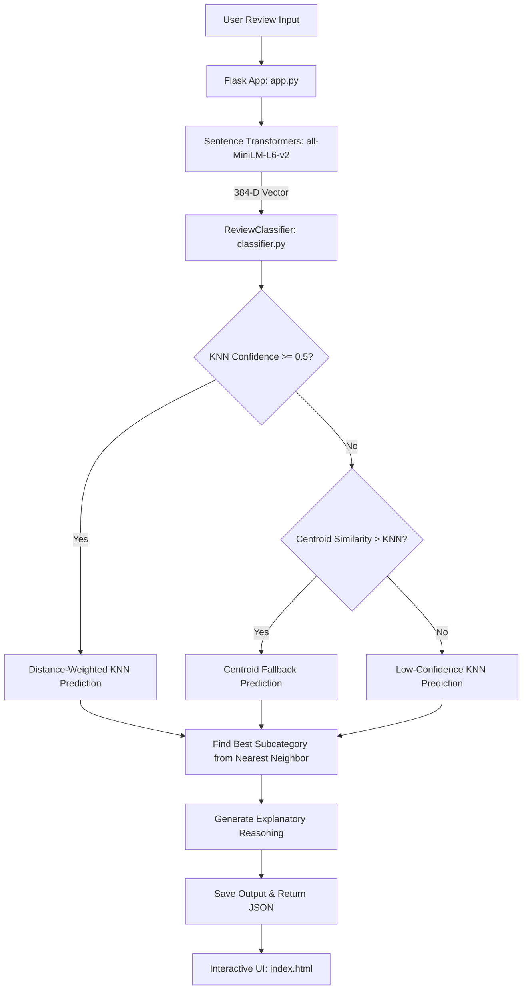

# AI Interview Review Classifier 🤖📊

A modern, high-performance web application and machine learning classifier that semantically analyzes candidate interview reviews. The system converts raw feedback into sentence embeddings and applies a **distance-weighted K-Nearest Neighbors (KNN)** algorithm with a custom **Centroid Fallback** system to perform high-fidelity categorization, subcategorization, and confidence estimation.

The interface is built as a single-page application using **Flask** and custom **glassmorphic vanilla CSS** designed for a premium, developer-centric experience.

---

## 🌟 Key Features

*   **Semantic Text Embeddings**: Uses the state-of-the-art `all-MiniLM-L6-v2` SentenceTransformer model to translate candidate feedback into dense, 384-dimensional vectors.
*   **Distance-Weighted KNN ($k=5$)**: Classifies text using cosine similarity. Closer neighbors exert a higher influence on the predicted category than distant ones.
*   **Centroid Fallback System**: If KNN confidence falls below $50\%$ and a specific category's average vector (centroid) shows a stronger similarity to the input, the classifier intelligently switches to a centroid-based classification as a tie-breaker.
*   **Granular Taxonomy**: Automatically maps reviews into 7 primary categories and 21 specific subcategories.
*   **Explainable AI (XAI) Reasoning**: Generates a detailed, natural-language explanation of the decision-making process, highlighting neighbor agreement ratios, similarity percentages, and fallback triggers.
*   **Human-in-the-Loop Flagging**: Automatically flags reviews with a confidence score below $60\%$ as needing human review.
*   **Stunning Web Dashboard**: Features a gorgeous, interactive dark-mode interface detailing probability distributions, centroid similarities, and a direct breakdown of the 5 nearest training examples.

---

## 🏗️ Architecture & Tech Stack



### Backend & ML Core
*   **Python 3.10+**: Core programming language.
*   **Flask**: Lightweight web server to serve the frontend and classification API.
*   **scikit-learn**: Powers the `KNeighborsClassifier` model.
*   **Sentence-Transformers**: Generates deep semantic text representations.
*   **PyTorch / NumPy**: Underlying tensor math and embedding computations.
*   **Pickle**: Serializes and caches the trained model state (`review_classifier.pkl`) for near-instantaneous subsequent loads.

### Frontend
*   **HTML5 & Vanilla CSS**: Custom responsive layout featuring vibrant color palettes, radial glow backdrops, glassmorphism, and micro-interactions.
*   **JavaScript (ES6+)**: Handles dynamic asynchronous fetching, chart rendering, and interactive UI updates.

---

## 🗂️ Taxonomy Structure

The model uses a diverse set of hand-labeled seed sentences to classify reviews into the following taxonomy:

| Primary Category | Subcategories | Description |
| :--- | :--- | :--- |
| **Technical Issue** | Audio & Voice, Network & Lag, Platform & UI Bugs | Stability, lag, or device detection problems during the interview. |
| **UX / Flow Issue** | Repetitive Questions, Timing/Interruptions, Question Relevance, Lack of Acknowledgment | Flow friction, poor timing, or irrelevant conversation jumps. |
| **Positive Feedback** | Natural Experience, Question Quality, Overall Satisfaction | General praise for conversational realism or system quality. |
| **Interview Incomplete**| Disconnection, Agent Failure, Premature End | Sessions cutting short or the AI agent failing to respond mid-interview. |
| **Feature Request** | AI Personality, Interview Content, Platform Features | Suggestions for tone adjustments, domain questions, or UI toggles. |
| **Neutral / Generic** | Positive Vague, Neutral/Ambivalent, Gratitude Only | Short, generic responses (e.g., "thanks", "it was okay"). |
| **Negative / Generic** | Negative Vague, Mild Dissatisfaction | General dissatisfaction without specifying particular technical or UX issues. |

---

## ⚡ Setup & Installation

### Prerequisites
Make sure you have Python 3.10+ installed on your system.

### 1. Clone the Repository
```bash
git clone https://github.com/Manavv007/Embedding-KNN-classifier.git
cd Embedding-KNN-classifier
```

### 2. Set Up a Virtual Environment (Recommended)
On macOS/Linux:
```bash
python3 -m venv venv
source venv/bin/activate
```
On Windows:
```bash
python -m venv venv
venv\Scripts\activate
```

### 3. Install Dependencies
```bash
pip install -r requirements.txt
```
*Note: Installing `torch` and `sentence-transformers` for the first time may take a few minutes.*

### 4. Run the Application
```bash
python app.py
```
The application will start in debug mode on **`http://127.0.0.1:5000`**.

---

## 🔌 API Reference

### Classify Review
Classifies a raw text review into categories and returns similarity comparisons.

*   **URL**: `/classify`
*   **Method**: `POST`
*   **Headers**: `Content-Type: application/json`
*   **Body**:
    ```json
    {
      "review": "The AI interviewer kept talking over me and didn't let me finish my sentence."
    }
    ```

*   **Response (200 OK)**:
    ```json
    {
      "review": "The AI interviewer kept talking over me and didn't let me finish my sentence.",
      "category": "ux_flow_issue",
      "category_label": "UX / Flow Issue",
      "category_description": "Confusing flow, repetitive questions, timing issues, or display problems.",
      "subcategory": "timing_interruption",
      "subcategory_label": "Timing & Interruptions",
      "confidence": 1.0,
      "needs_human_review": false,
      "method": "knn",
      "method_label": "Distance-weighted KNN",
      "probabilities": {
        "UX / Flow Issue": 1.0,
        "Technical Issue": 0.0,
        ...
      },
      "centroid_similarities": {
        "UX / Flow Issue": 0.648,
        "Feature Request": 0.384,
        ...
      },
      "nearest_neighbors": [
        {
          "text": "AI interrupted me before I finished answering",
          "category": "ux_flow_issue",
          "category_label": "UX / Flow Issue",
          "subcategory": "timing_interruption",
          "subcategory_label": "Timing & Interruptions",
          "similarity": 0.825
        },
        ...
      ],
      "reasoning": "Your review was compared against 125 labeled seed examples using normalized sentence embeddings and distance-weighted k-nearest neighbors (k=5)..."
    }
    ```

---

## 🧠 Machine Learning Details

1. **Embedding Model**: The text is encoded using `all-MiniLM-L6-v2`. This model maps text to a 384-dimensional dense vector space where semantically similar sentences are close to each other.
2. **K-Nearest Neighbors**:
   * **Distance Metric**: Cosine distance (equivalent to $1 - \text{cosine\_similarity}$ on normalized embeddings).
   * **Distance Weights**: Neighbor weights are calculated as $\frac{1}{\text{distance}}$. Closer neighbors have a larger vote in predicting the class.
3. **Centroid-Based Tie-breaker**:
   * For each of the 7 categories, we precalculate a **Centroid Vector** by finding the average embedding of all seed examples in that class and normalizing it.
   * When KNN returns high uncertainty (confidence < $50\%$), the cosine similarity between the input's embedding and all 7 class centroids is evaluated. If the closest centroid has a higher similarity score than the KNN confidence, the prediction falls back to that centroid category.
